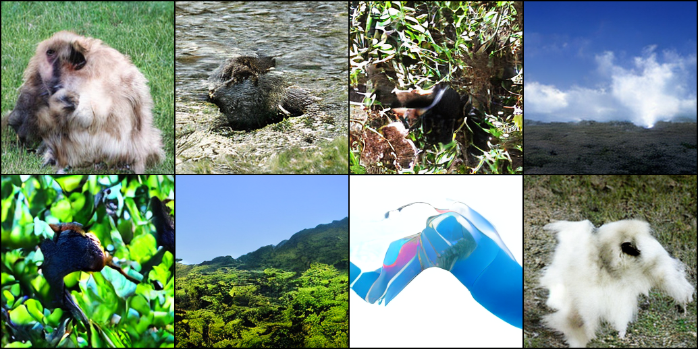

## GenTron: Diffusion Transformers for Image and Video Generation

### Unofficial PyTorch Implementation

### [Paper](https://arxiv.org/abs/2312.04557) | [Project Page](https://www.shoufachen.com/gentron_website)

> [**GenTron: Diffusion Transformers for Image and Video Generation**](https://www.shoufachen.com/gentron_website)</br>
> Shoufa Chen, Mengmeng Xu, Jiawei Ren, Yuren Cong, Sen He, Yanping Xie, Animesh Sinha, Ping Luo, Tao Xiang, Juan-Manuel Perez-Rua
> <br>The University of Hong Kong, Meta</br>

This repository contains:

* 🪐 A simple PyTorch [implementation](models.py) of Text-to-Image GenTron
* 🛸 A GenTron [training script](train.py)

## Setup

[DiT](https://github.com/facebookresearch/DiT) and [PixArt-α](https://github.com/PixArt-alpha/PixArt-alpha)

## Sampling



```bash
python sample.py --image_size 512 --seed 1
```

```bash
python sample.py --model GenTron-T2I-XL/2 --image_size 256 --ckpt /path/to/model.pt
```

| GenTron Model | Train Steps | Image Resolution |
|---------------|-------------|------------------|
| [B/2](https://huggingface.co/lavinal712/GenTron-T2I-B-2-256) | 150000 | 256x256 |

## Training T2I Model

### Preparation

```bash
torchrun --nnodes=1 --nproc_per_node=1 extract_features.py --data_path /path/to/ImageNet/train --features_path /path/to/ImageNet/features
```

### Training

Train GenTron-T2I model directly.

```bash
accelerate launch --mixed_precision fp16 train.py --model GenTron-T2I-XL/2 --data_path /path/to/ImageNet/train
```

```bash
accelerate launch --multi_gpu --num_processes N --mixed_precision fp16 train.py --model GenTron-T2I-XL/2 --data_path /path/to/ImageNet/train
```

Train GenTron-T2I model with extracted features.

```bash
accelerate launch --mixed_precision fp16 train_v2.py --model GenTron-T2I-XL/2 --features_path /path/to/ImageNet/features
```

```bash
accelerate launch --multi_gpu --num_processes N --mixed_precision fp16 train_v2.py --model GenTron-T2I-XL/2 --features_path /path/to/ImageNet/features
```

## Training T2V Model

### Preparation

WebVid-10M Datset.

```
Assumes webvid data is structured as follows.
Webvid/
    videos/
        000001_000050/      ($page_dir)
            1.mp4           (videoid.mp4)
            ...
            5000.mp4
        ...
```

MSR-VTT Datset.

The official data and video links can be found in [link](http://ms-multimedia-challenge.com/2017/dataset). 

For the convenience, you can also download the splits and captions by,
```sh
wget https://github.com/ArrowLuo/CLIP4Clip/releases/download/v0.0/msrvtt_data.zip
```

Besides, the raw videos can be found in [sharing](https://github.com/m-bain/frozen-in-time#-finetuning-benchmarks-msr-vtt) from *Frozen️ in Time*, i.e.,
```sh
wget https://www.robots.ox.ac.uk/~maxbain/frozen-in-time/data/MSRVTT.zip
```

### Training

Train GenTron-T2V model directly.

```bash
accelerate launch --multi_gpu --num_processes N --mixed_precision fp16 train_t2v.py --model GenTron-T2V-XL/2 --meta_path /path/to/webvid/results_10M_train.csv --data_dir /path/to/webvid
```

```bash
accelerate launch --multi_gpu --num_processes N --mixed_precision fp16 train_t2v.py --model GenTron-T2V-XL/2 --meta_path /path/to/msrvtt_data/MSRVTT_data.json --data_dir /path/to/MSRVTT
```

## Acknowledgments

- [DiT](https://github.com/facebookresearch/DiT)
- [fast-DiT](https://github.com/chuanyangjin/fast-DiT)
- [PixArt-α](https://github.com/PixArt-alpha/PixArt-alpha)
- [DynamiCrafter](https://github.com/Doubiiu/DynamiCrafter)
- [CLIP4Clip](https://github.com/ArrowLuo/CLIP4Clip)
